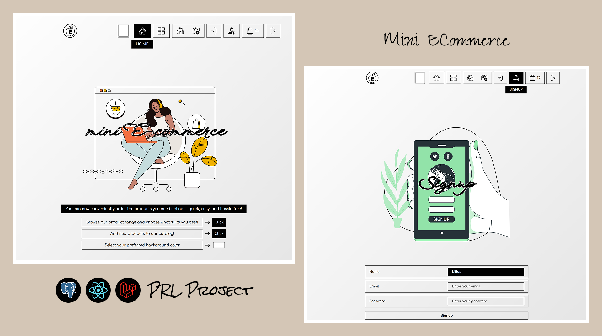
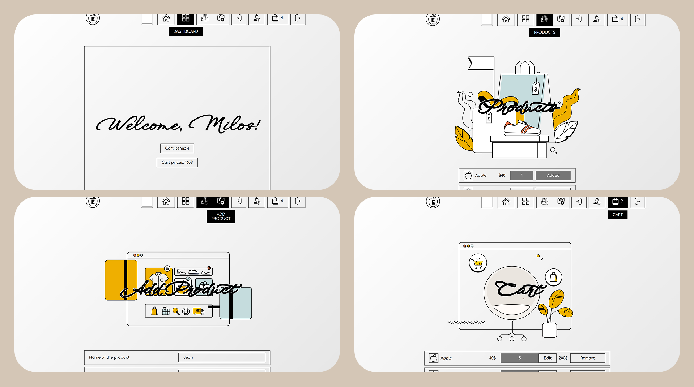

# Mini ECommerce__PRL

## Table of contents

- [Preview](#preview)
- [About](#about)
  - [Tools & Requirements](#tools--requirements)
- [Local Installation](#local-installation)
- [Frontend](#frontend)
  - [Components & Reusable Code](#components--reusable-code)
  - [Redux](#redux)
  - [Authentication System](#authentication-system)
  - [Guarded Routes](#guarded-routes)
  - [Products & Cart](#products--cart)
  - [Color Picker & Decorative Images](#color-picker--decorative-images)
- [Backend](#backend)
  - [Routes](#routes)
  - [Authentication system with Laravel Sanctum](#authentication-system-with-laravel-sanctum)
  - [PostgreSQL as a database](#postgresql-as-a-database)
  - [Models, Controllers & Migrations](#models-controllers--migrations)
- [Credits](#credits)

## Preview

## About

A website designed to help users conveniently order the products they need online. This project demonstrates my knowledge of Laravel as the backend, React as the frontend, and PostgreSQL as the database, as well as how they are integrated into a full-stack application. Users can add or remove products from the cart and update product quantities. User registration and login are required to access these features.

### Tools & Requirements

- Frontend
  - ***Development environment***: Vite
  - ***Language***: TypeScript
  - ***Framework***: React
  - ***State Management***: Redux
  - ***Architecture***: SPA (Single Page Application)
  - ***Approach***: Mobile-first workflow
  - ***Routing***: React Router
  - ***Structure***: Reusable code and components
  - ***Skeleton***: Semantic HTML5 markup
  - ***Styling***: CSS/SASS
  - ***Features***:
    - Register/Login system
    - Cart feature
    - Products feature
  - ***Dynamism***:
    - Transitions
    - Hover effects
  - ***Accessibility***:
    - Responsive design (viewport sizes, REM/EM units)
    - Visibility for screenreaders
    - ARIA (Accessible Rich Internet Applications) roles & attributes
  - ***Library***: Axios, react-router-dom
- Backend
  - ***Runtime***: 	PHP 8
  - ***Language***: PHP
  - ***Framework***: Laravel
  - ***Arhitecture***: MVC + RESTful API
  - ***Database***: PostgreSQL
  - ***ORM***: Eloquent ORM
  - ***Authentication System***: Laravel Sanctum
  - ***Security***:
    - CSRF Protection
    - CORS Configuration
   
## Local Installation
   
## Frontend

On the client side, users can add products to their cart, modify the cart, and add new products to the product list. To have a personal cart, the user must first register and then log in. The frontend communicates with the backend using the Axios library, which fetches data from the server and displays it to the user. Redux with persistence is used for locally storing user-related data (such as cart and authentication), as well as product data and selected color preferences, which are visible even without registration.

### Components & Reusable Code

To improve code readability, maintainability, and structure, the project is organized into smaller components that serve as blueprints or templates. These components can be reused with variations by passing different props when invoked.

### Redux

The data fetched from the backend is temporarily stored in local or session storage, and thanks to Redux Persist, it can also persist across page reloads. Redux is implemented through a system of communication between the store, reducers, and dispatchers. The dispatcher reacts to actions defined in reducers and informs them of the new state, which is then saved in the store.
State is handled through different slices (e.g., cartSlice, productsSlice) and thunks that handle asynchronous backend requests. Each slice defines an initial state and actions to modify it (e.g., addToCart, removeFromCart), as well as thunks for operations like loginUser and fetchProducts.

### Authentication System

For purchasing products online, users are required to register by filling out a form with necessary information, including email and password. After successful registration, the user can log in and is redirected to a dashboard page, which is protected and inaccessible to non-authenticated users.
Once logged in, user data is saved in localStorage under the Application tab. Thanks to Redux Persist, this data persists even after tab closure or page refresh (and possibly even server restarts, depending on implementation).
The authSlice is used to manage authentication data, using actions and thunks like registerUser, loginUser, and logoutUser. The user token is stored once the user logs in and removed upon logout.

### Guarded Routes

A custom GuardPage component was created to protect routes. It checks whether the user exists in the Redux state. If the user is authenticated, access is granted to the requested route; otherwise, the user is redirected to the login page. GuardPage wraps the target route to provide this logic.

### Products & Cart

Both products and the cart are managed by their respective slices (productsSlice and cartSlice), which update state using actions and thunks. Actions like addToCart and removeFromCart update the local state, and then a thunk (e.g., updateCart) is called to asynchronously update the backend.
A product can’t be added multiple times to the cart; it becomes available again only after being removed from the cart. Inside the cart, users can also change the product quantity using the changeQuantity action.

### Color Picker & Decorative Images

A better user experience is achieved by allowing user personalization and subtle interaction. Decorative illustrations are used to hold user attention, and a color picker allows users to choose a dominant color for the interface. The selected color is stored in colorSlice and persists in localStorage (for both guest and logged-in users).
Thanks to Redux, this color preference can be used across multiple parts of the app, including the generation of a complementary color, which is then used for text color, borders, and other visual elements.

## Backend

The backend is responsible for authentication logic, database setup, and data manipulation. It is built using PHP with the Laravel framework. The application follows the MVC architecture and uses a RESTful API approach.

Unlike the traditional MVC structure where views (e.g., Blade templates) are rendered on the server side, this project uses JSON responses to communicate with a separately developed React frontend. Although Laravel can integrate frontend technologies like React using Inertia.js, in this case, the frontend is fully decoupled from the backend and communicates exclusively via API requests.

### Routes

In the routes directory, Laravel organizes routes into separate files, such as web.php and api.php. Since React is handled outside of the Laravel stack in this project, all routes are defined inside api.php.

Due to the automatic route prefixing configured in Laravel’s bootstrap folder, all api.php routes are automatically prefixed with /api in the URL. 

Routes can be defined in two main ways:

- Using specific HTTP methods:

- Using Route::resource, which automatically generates a full set of RESTful routes (index, show, store, update, destroy). If only a subset of actions is needed, you can limit it using the only() method.

### Authentication system with Laravel Sanctum

This project uses Laravel Sanctum for API authentication. Sanctum allows issuing personal access tokens, which are then stored and attached to the Authorization header on the frontend.

When the user registers, the register action in the controller first validates the incoming data from the request. If the validation passes, the password is hashed and a new user is created using  (User::create()). Immediately after registration, a new cart is also created for the user (Cart::create()). Finally, an access token is generated using Sanctum (createToken()).

During login, the login action first validates the request data, and then attempts to authenticate the user using (Auth::attempt() & Auth:user()). If authentication is successful, a new token is generated in the same way as during registration. The frontend stores this token and sets it as a Bearer token in the Authorization header for all subsequent API requests using Axios.

On logout, the logout action invalidates all tokens associated with the user by calling (user()->tokens()->delete()). This effectively ends the user's session on the backend and ensures that any previously issued tokens are no longer valid. Since authentication is handled via token-based Bearer authorization and not cookies, CSRF tokens are not required for API requests.

### PostgreSQL as a database

Laravel supports a wide range of databases, including PostgreSQL. Models such as Cart, User, and Product are used to define the structure of database tables, specifying which fields each record should contain (e.g., name, price for the Product model).

Controllers handle the business logic and act as intermediaries between the client (frontend) and the database. Since the structure of database tables may evolve over time, Laravel migrations are used to apply changes using the built-in up and down methods.

The client communicates with the backend through API requests sent using the Axios library. Axios handles sending requests and automatically parses JSON responses into usable JavaScript objects.

Laravel’s Eloquent ORM (Object Relational Mapper) simplifies database interactions by allowing developers to work with database records as if they were standard PHP objects. This includes defining relationships between models (such as one-to-one or one-to-many), automatically mapping foreign keys, and using expressive syntax to interact with the database.

### Models, Controllers & Migrations

Laravel models can include predefined properties like $fillable, which specifies which fields are mass-assignable (i.e., can be safely filled with data from a request), and $hidden, which defines which attributes should be excluded when the model is converted to JSON (for example, hiding the password field).

Additionally, the $casts property allows you to specify how certain attributes should be cast, such as converting a timestamp into a date or a string into a boolean.

Model relationships can also be defined through Eloquent methods like hasOne, hasMany, and belongsTo. For instance, in the User model, you can define a hasOne relationship to a Cart, indicating that each user can have one cart. On the other hand, the Cart model would define a belongsTo relationship back to the User, since the carts table contains a user_id foreign key that references the users table.

Controllers coordinate the logic for each route. Each route is typically associated with a method (or “action”) in a controller. For example, when a route calls the index action for a resource like Product, the controller is expected to return a list of all product records. This is often done using Product::all().

Migrations in Laravel follow a clear structure. Once initial migrations are applied, further database changes should be made via new migration files rather than altering old ones. The migration file names usually follow a naming convention like create_products_table, where the prefix is automatically generated based on the timestamp.

For the first creation of a table, Schema::create() is used in the up method, and Schema::dropIfExists() in the down method. For subsequent modifications to existing tables, Schema::table() is used instead of create(), since the table already exists.

One powerful feature of migrations is the ability to define cascading deletions. For example, if a user is deleted, their associated cart should be deleted automatically. This is achieved by using methods like foreignId('user_id')->constrained()->onDelete('cascade'), where constrained() links the foreign key to the related table (in this case, users), and onDelete('cascade') ensures related records are deleted as well.

### CORS Configurations

## Credits
